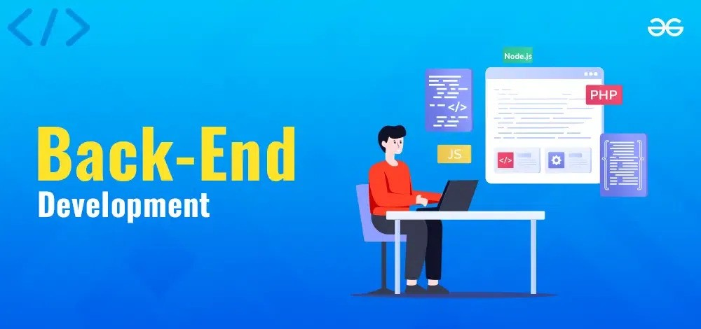

# Back-End Web Development 1
Course Code: HTTP 5125

Academic Year: 2025-2026

In this course, students are introduced to server-side web development with the C# programming language, and will implement techniques for creating data-driven websites drawing from various external data sources.

# Links
https://www.geeksforgeeks.org/backend-development/

# Images

.

> **Note**:This repository focuses on server-side functionality using C#. For those new to back-end development, it’s recommended to have a foundational understanding of databases and APIs, as these concepts are essential for creating dynamic, data-driven applications.

# Code Example:
